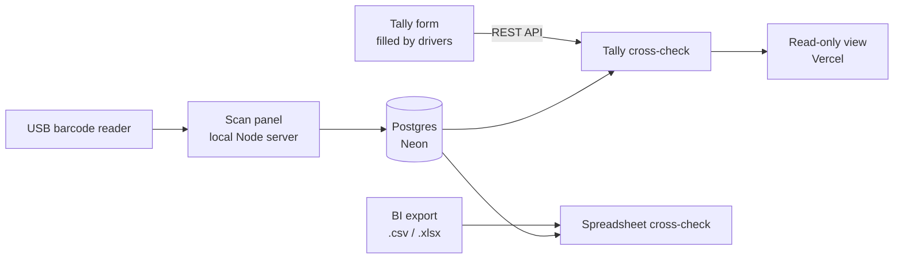

# estoque

A small web app for tracking parcels that come back to a last-mile delivery base. Operators scan returned parcels with a USB barcode reader, and the app cross-checks those scans against what drivers reported in a form and against an exported BI spreadsheet.

Before this, returned parcels had no record at all. There was no way to tell which ones had come back and which ones should have come back but didn't. The panel created that history and made the gaps visible.

> **Note:** sanitized copy of a tool I built and use at work. Database URLs, API keys, form ids and real product codes were removed. The UI and the user guide are in Portuguese.

## What it does



- **Continuous scanning.** Unlock once, then scan item after item without touching the mouse. Every read gives a distinct beep for *saved*, *error* or *duplicate*. A unique index in the database guarantees a code is never stored twice. It also handles readers that don't send Enter (120 ms idle timeout) and double triggers from the reader.
- **Tally cross-check.** Drivers declare returned parcels in a Tally form. The app pulls submissions through the Tally API and splits into three lists: *declared and scanned*, *declared but never scanned*, *scanned but never declared*. Codes typed by hand are messy (several per field, glued together, numbered lists), so a parser splits them and suggests the closest scanned code for likely typos.
- **Spreadsheet cross-check.** Drop, pick or paste an exported spreadsheet and see the status of each stored parcel (return, custody, redeliver…). The app detects which columns hold the code and the status, and undoes Excel damage such as scientific notation and stripped leading zeros. It flags parcels with conflicting statuses and exports the view as CSV.
- **Read-only view.** A second port, also deployed to Vercel as a serverless function, shows only the Tally cross-check. It accepts only GET requests, serves a whitelist of static files, and can't change data. Colleagues can check it with the scanning PC turned off.

## Technical notes

- Node.js with **one dependency** (the Neon Postgres driver). HTTP server, routing, static files and the CSV/XLSX readers are written with the standard library. An `.xlsx` is a ZIP of XML files, unpacked with the built-in `zlib`.
- Tables are created on startup (`db.js`): `itens` (scans), `tally_confirmacoes` (typo fixes an operator confirmed), `tally_resolvidos` (issues marked as handled).
- The Tally API key stays on the server and is never sent to the browser.
- The Vercel build (`scripts/montar-site.js`) publishes only the read-only page and one API route, with `noindex` headers.
- `scripts/migrar-para-neon.js` is the one-off migration from the first version, which used local SQLite.

## Project layout

```
server.js         HTTP server and API (scan panel + read-only port)
db.js             Postgres access and scan rules
tally.js          Tally API client, code splitting, confirmations
conferencia.js    Tally cross-check (shared by local server and Vercel)
planilha.js       dependency-free CSV and XLSX readers
public/           panel, cross-check screens, read-only page, styles
api/              Vercel serverless function
scripts/          Vercel build and SQLite → Postgres migration
docs/USER-GUIDE.md  end-user guide (Portuguese)
```

